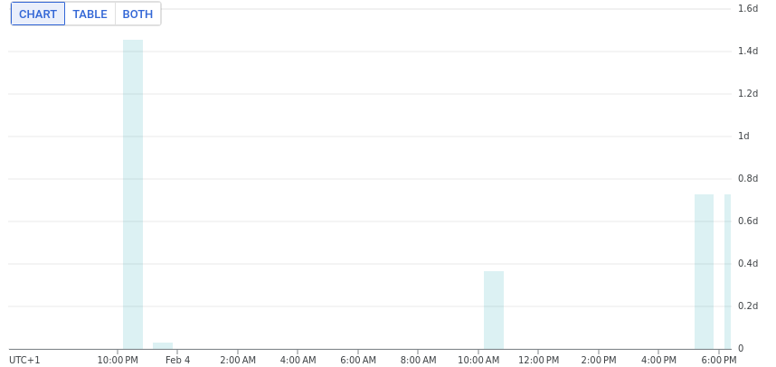

# DevOps Metrics

Research from the book [_Accelerate_](https://en.wikipedia.org/wiki/Accelerate_(book)), as well as findings from [Puppet's State Of DevOps Report](https://www.puppet.com/resources/state-of-devops-report) and [Google's DORA initiative](https://dora.dev), underscore four crucial metrics for DevOps success:

- **Lead Time**: Time from code commit to deployment.
- **Deployment Frequency**: How often deployments occur.
- **Change Fail Rate**: Percentage of deployments causing a failure in production.
- **Mean Time to Recovery (MTTR)**: Time taken to recover from a failure.

This repository uses the example of **lead time** to illustrate how these metrics can be measured in CI/CD pipelines.

_Hint: while following instructions are for GCP Cloud Build pipelines, the same principle can also be applied to other pipeline frameworks._

## How It Works

The module [git-metrics](https://github.com/Praqma/git-metrics/) is mainly for creating statistic reports from code repositories but it's methods can also be leveraged in CD pipelines to examine commit metadata from annotated tags. This is achieved by adding a repository checkout and an additional final step to your deployment pipeline which utilizes git-metrics. The additional overhead is a reasonable trade-off in order to collect the insightful metrics mentioned before.

For the lead time, it checks the commit's author date and simply calculates the time difference until time of deployment as measured by the CD pipeline.

## Usage

Build and push the docker image to the GCR: `docker build -t gcr.io/PROJECT_ID/devops-metrics . && docker push gcr.io/PROJECT_ID/devops-metrics`

Since Cloud Build is only doing a shallow checkout of a repository, you need to include a step to [fetch the entire history](https://cloud.google.com/build/docs/automating-builds/create-manage-triggers#including_the_repository_history_in_a_build) including tags:

```
- name: gcr.io/cloud-builders/git
  dir: /workspace
  args:
    - fetch
    - '--unshallow'
    - '--tags'
    - 'git@github.com:${REPO_FULL_NAME}'
```

Insert a step like the following in your Cloud Build pipeline last step in order to measure two things: lead time and pipeline time. Though pipeline time isn't a primary DevOps metric, it's useful for monitoring pipeline efficiency.

```
- name: 'gcr.io/my-images/devops-metrics'
  dir: /app
  env:
  - 'REPO_PATH=/workspace'
  - 'TAG_NAME=${TAG_NAME}'
  - 'BUILD_ID=${BUILD_ID}'
  - 'PROJECT_ID=${PROJECT_ID}'
```

## Tracking and Graphing Metrics
The lead time will now be logged and can be extracted with a log-based metric of type distribution that uses following attributes:
- build filter: `resource.type="build" AND textPayload:"lead_time"`
- field name: `textPayload`
- regular expression: `lead_time:\s([0-9]+\.[0-9]{1,6})`

In the log-based metrics view, you can then open the Kebab menu next to your user defined metric under 'View in Metrics Explorer' to create a chart like this:


By following these steps, you'll gain valuable insights into your deployment process, enabling continuous improvement in your DevOps practices.